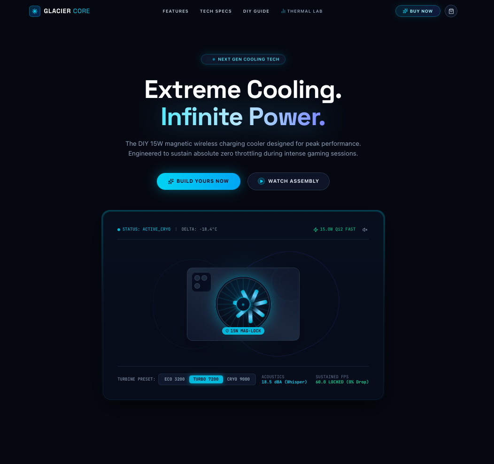
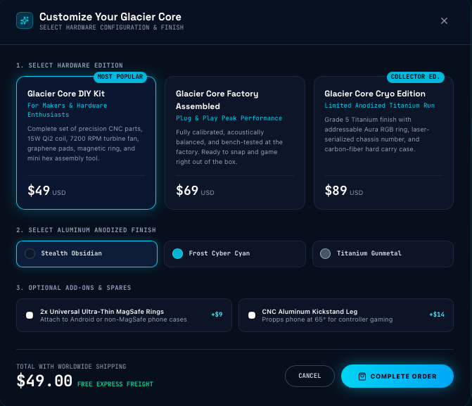
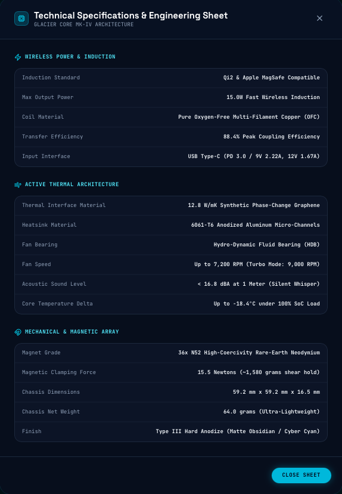
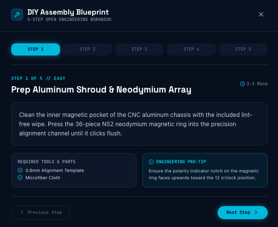

# Glacier Core - Magnetic Wireless Charging Cooler

Welcome to the **Glacier Core** web platform — the official marketing and interactive showcase for the ultimate magnetic wireless charging cooler. Designed for mobile gamers and power users, this landing page features interactive 3D-like blueprint views, thermal simulations, and an integrated reservation system.

## 📸 Showcase

### Landing Page


### Thermal Lab Demo
<video src="https://github.com/Sankalp28Roop/Glacier-core---magnetic-wireless-charging-cooler/raw/main/assets/video/Thermal-lab.mp4" width="100%" controls></video>

### Start Your Build


### Tech Specs


### Assembly Guide


## 🚀 Features

- **Interactive Thermal Simulator**: An interactive lab showcasing the cooling efficiency of the Glacier Core under various load scenarios.
- **Exploded Blueprint View**: A detailed, component-level breakdown of the cooler's internal architecture, perfect for DIY enthusiasts.
- **Dynamic Shopping Cart**: A streamlined reservation and checkout interface for pre-ordering the device.
- **Responsive & Cinematic Design**: A dark-mode optimized, visually striking UI with smooth animations, powered by Tailwind CSS and Framer Motion.
- **Informative Modals**: Built-in modal overlays for Technical Specs, Assembly Videos, DIY Guides, and Purchasing.

## 🛠 Tech Stack

- **Framework:** React 19 + Vite
- **Styling:** Tailwind CSS v4
- **Animations:** Framer Motion
- **Icons:** Lucide React
- **Language:** TypeScript

## 📦 Project Structure

```text
src/
├── components/
│   ├── ActiveCoolingSection.tsx  # Highlights the active cooling tech
│   ├── AssemblyVideoModal.tsx    # Modal for video playback
│   ├── BuyModal.tsx              # Pre-order and cart interface
│   ├── DiyGuideModal.tsx         # Instructions for DIY builders
│   ├── EvolutionSection.tsx      # Product design philosophy
│   ├── ExplodedBuildSection.tsx  # Component breakdown
│   ├── Footer.tsx                # Site footer
│   ├── Hero.tsx                  # Main landing view
│   ├── Navbar.tsx                # Navigation and cart toggle
│   ├── StealthFeatures.tsx       # Feature highlights
│   ├── TechSpecsModal.tsx        # Technical specifications sheet
│   └── ThermalSimulator.tsx      # Interactive benchmark tool
├── App.tsx                       # Main application layout and state
├── index.css                     # Global styles and Tailwind imports
└── main.tsx                      # Entry point
```

## 💻 Running Locally

### Prerequisites
Make sure you have [Node.js](https://nodejs.org/) (v18+ recommended) installed.

### 1. Clone the repository
```bash
git clone https://github.com/Sankalp28Roop/Glacier-core---magnetic-wireless-charging-cooler.git
cd glacier-core---magnetic-wireless-charging-cooler
```

### 2. Install dependencies
```bash
npm install
```

### 3. Start the Development Server
```bash
npm run dev
```

The application will start, usually accessible at `http://localhost:3000` or `http://localhost:3001` depending on port availability.

---

*Engineered for Stealth. The Science of Absolute Zero.*
